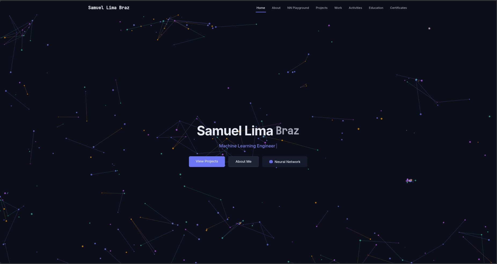

# Samuel Lima Braz - Personal Portfolio



Welcome to my personal portfolio website repository! This portfolio showcases my background, technical expertise, projects, and professional experience in machine learning, computer vision, and autonomous systems.

## Features

- **Interactive UI** - Responsive design with smooth animations using Framer Motion
- **Neural Network Playground** - Interactive playground to experiment with neural networks
- **Project Showcase** - Featured projects with descriptions, tags, and code examples
- **Professional Experience** - Timeline of work experience and accomplishments
- **Education** - Academic background and qualifications
- **Certificates** - Professional certifications and achievements
- **Dynamic Code Examples** - Syntax highlighted code samples from my projects

## Technologies Used

### Frontend
- **React** - UI library for building component-based interfaces
- **TypeScript** - Type-safe JavaScript for robust applications
- **Vite** - Fast, modern frontend build tool
- **Tailwind CSS** - Utility-first CSS framework for rapid styling
- **Framer Motion** - Animation library for creating fluid UI transitions

### UI Libraries & Visualization
- **Plotly.js** - Interactive data visualization
- **Three.js** - 3D graphics library for WebGL rendering
- **D3.js** - Data-driven document manipulation for visualizations
- **React Three Fiber** - React renderer for Three.js
- **Embla Carousel** - Lightweight carousel component for project showcase
- **Lucide React** - Beautiful, consistent icon set
- **React Syntax Highlighter** - Code syntax highlighting

## Project Structure

- `src/` - Source code
  - `components/` - React components
    - `HeroSection.tsx` - Landing page with interactive background
    - `AboutSection.tsx` - Personal information and bio
    - `NNPlayground.tsx` - Interactive neural network visualization
    - `ProjectsCarousel.tsx` - Project showcase with carousel
    - `WorkSection.tsx` - Professional experience timeline
    - `EducationSection.tsx` - Academic background
    - `CertificatesSection.tsx` - Professional certifications
    - `Navbar.tsx` - Navigation component
    - `Footer.tsx` - Footer component
  - `data/` - Data files
    - `projects.ts` - Project information and metadata
  - `lib/` - Utility functions and type definitions
    - `types.ts` - TypeScript interface definitions
    - `nn/` - Neural network implementation for playground
  - `pages/` - Application pages
  - `App.tsx` - Main application component
  - `main.tsx` - Application entry point


## Setup and Installation

To run this project locally:

```bash
# Clone the repository
git clone https://github.com/samuellimabraz/samuellimabraz.github.io.git
cd samuellimabraz.github.io

# Install dependencies
npm install

# Start the development server
npm run dev

# Build for production
npm run build

# Preview the production build
npm run preview
```

## Contact

- GitHub: [samuellimabraz](https://github.com/samuellimabraz)
- LinkedIn: [Samuel Lima Braz](https://linkedin.com/in/samuel-lima-braz)
- Email: [contact@samuellima.dev](mailto:contact@samuellima.dev)

## License

This project is licensed under the MIT License - see the LICENSE file for details. 